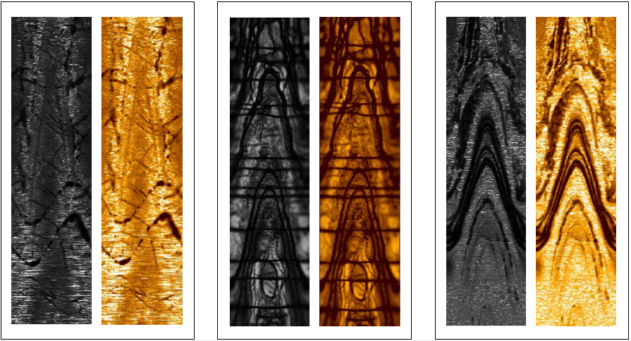
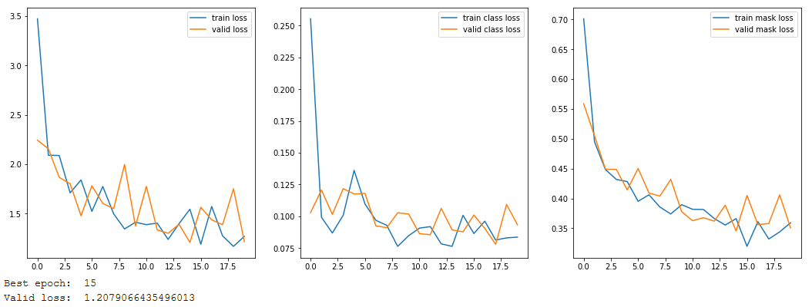

# **Image Resolution Classification - imres**

### 1. Introduction

Image logs are valuable sources of information used to support the development of petroleum fields.

They allow geoscientists to characterize visually and in a continuous manner different properties of the rocks perfurated by a well. This is used for building more reliable geological models of a field, which leads to more realistic production curves. 

Low resolution images or those presenting strong non-geological attributes (i.e. distortion, noise, pixelated images, etc.) - in other words, displaying low quality - are hard to interpret, losing part of their potential value. Image resolution can be defined based on whether it permits identification of small-scale features (such as structural information), large-scale features (such as lithology discontinuities), or no features at all.

Images obtained via LWD tools (*Logging While Drilling*) reduce the cost of acquisition, when compared to those obtained with wireline tools; however, they are also more susceptible to operational problems and, consequently, more likely to present lower quality.

The Figure below exemplifies well segments with low (red flag) and high (green flag) quality.

XX

### 2. Objective

The objective of this project is to construct a neural network capable of automatically identifying the low, medium and high resolution parts of a LWD image.

The purpose of this classification is to assist in quickly determining if a particular image ha been properly obtained and will be of use in the geological modelling process.

This knowledge can help support decision-making with regards to image acquisition for a particular well; for example, by indicating the need to perform a new LWD log or the need to include an imaging tool in the wireline assembly.

Furthermore, this information can also be correlated with different parameters used for monitoring the drilling operation (Weight-On-Bit, RPM, vibration, etc.), as well as with different BHA configurations being used to drill the wells of a field; thus, it can be used to identify potential factors that cause the image quality to degrade and allow the operator to take action accordingly.

### 3. Data & Methodology

The data used in this project were the processed LWD images from 11 wells of various types (vertical, horizonal or slanted), and that crossed different lithologies (sand or carbonate reservoirs). In addition, a log of the image resolution was provided for training the neural network, indicating which well depths had low, medium and high resolution data.

The first notebook of the repository **imres_data_setup** should be used to parse through the original image and annotation files, which are tens of thousands of lines long, and create smaller, individual image and annotation files. The width of each image created is 120 pixels, corresponding to each of the channels of the LWD tool, and identical to the original log image. The height of each image was chosen arbitrarily to equal 512 pixels. Cropping was also performed so as to match the depths of the well image and the well resolution logs. The individual annotation files carry the resolution classifications related to their corresponding images.

A visual verification of the indiviual images was performed to ensure that the individual files were being created correctly. The Figure below depicts some of the images that were created by this script (gray scale) alongside the corresponding segment of the original image (orange scale).

The second notebook of the repository **imres_data_split** is designed to separate the data into a training set and a validation set, while maintaining a similar proportion of low, medium and high resolution segments in each of the sets as are present in the total population of images.

The neural network to be used for this project is called Mask RCNN (*Region Based Convolutional Neural Network*), which is an extension of the Faster RCNN type of networks, and seeks to perform object detection and classification through the use of masks (which may be non-orthogonal in shape). The implementation of the Mask RCNN library used in this project was developed by matterport, and is available through a github repository.

### 4. Results

The third notebook of the repository **imres_train** initiates a mask rcnn network with the weights from the MSCOCO project and loads two datasets, one for training and another for validation, with the images and ground truth bounding boxes that were assigned to each set by the previous splitting algorithm.

Different combinations of training arrangements can be specified. The Figure below exemplifies a training sequence consisting of 4 epochs to train only the final layer of the network, adopting a larger learning rate, then 10 epochs to train all layers using a slightly smaller learning rate and, finally, 6 epochs to again train all layers now with a much smaller learning rate. Data augmentation and dropout were not used in this intance. The kernel was run on Colab with GPU, using batch size of 6 (larger batches than this tended to lead to OOM errors).

